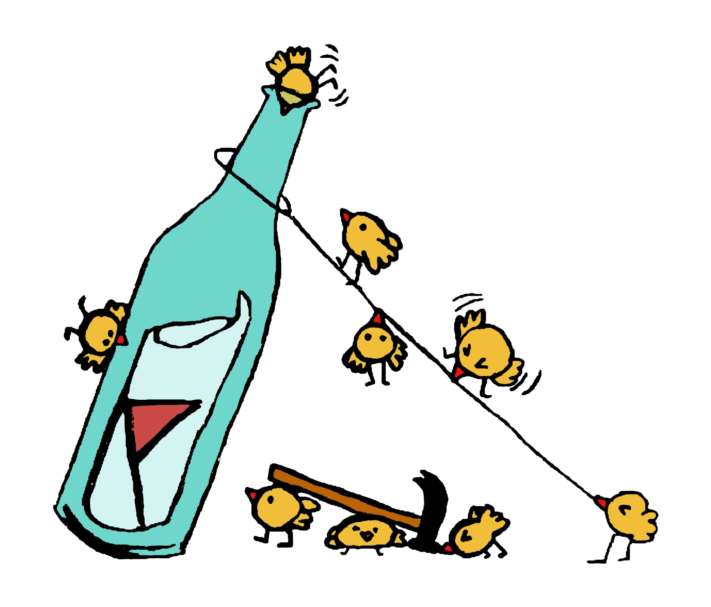

# roddbot

  

Roddbot is a Discord bot developed and used by the CTF team [RoyalRoppers](https://royalroppers.team).

## Features

- Organize communication when playing CTFs
- Easy to use slash commands
- Bulk import challenges from CTFd

## Configuration

| Environment variable | Description                       |
| -------------------- | --------------------------------- |
| RB_DISCORD_BOT_TOKEN | Discord access token              |
| RB_DB_DSN            | DSN string to a Postgres database |
